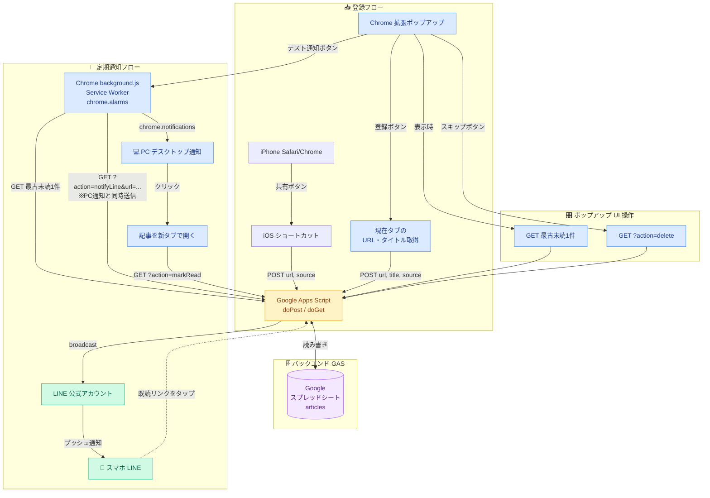

# 📖 Blog-Read-Forced

[](https://opensource.org/licenses/MIT)
[](https://script.google.com/)
[](https://developer.chrome.com/docs/extensions/mv3/)
[](https://developers.line.biz/)

> **「後で読む」を、今日読む。**

---

## 📖 概要

スマホで気になった記事を「後で読もう」とブックマーク。でも結局、何ヶ月も読まないまま埋もれていく。

**Blog-Read-Forced** は保存した記事を**強制的に通知して読ませる**、個人向け習慣ツールです。

iPhone で見つけた記事をワンタップで登録。あとは何もしなくても、Chrome とLINEが定期的に未読記事を1件ピックアップして通知してくれます。

### なぜ作ったのか

- 既存の「後で読む」アプリは**自分からアクセスしないと使われない**という根本問題がある
- **こちらから通知を送りつける**設計にすることで、習慣がない人でも自然に記事を読める
- サーバー管理・維持費ゼロで個人利用できる構成にしたかった

---

## ✨ 主な機能

- **iPhone からワンタップ登録**: 共有ボタン → iOS ショートカット経由で即座に保存
- **Chrome 拡張からワンクリック登録**: PC で見つけたページも同じリストへ
- **Chrome デスクトップ通知**: 設定間隔でバックグラウンドから未読記事を1件通知
- **LINE 同時通知**: Chrome 通知と同じタイミングで LINE にも記事を配信
- **スキップ機能**: 読みたくない記事をポップアップからワンクリックで削除
- **完全無料・サーバーレス**: Google Apps Script + スプレッドシートのみで動作

---

## 📸 スクリーンショット

| Chrome 拡張ポップアップ | デスクトップ通知 | LINE 通知 |
|:--:|:--:|:--:|
|  |  |  |

<!-- スクリーンショットを docs/images/ に配置してください -->

---

## 🛠 技術スタック

| カテゴリ | 技術 |
|:--|:--|
| 通知 / 登録 UI | Chrome 拡張（Manifest V3） |
| スマホ登録 | iOS ショートカット |
| バックエンド | Google Apps Script（Web アプリ） |
| データ保存 | Google スプレッドシート |
| LINE 通知 | LINE Messaging API（broadcast） |

---

## 🏗 アーキテクチャ



### 図の読み方

- **登録フロー**：iPhone のショートカット or Chrome 拡張のボタンから、`doPost` で記事を保存。
- **定期通知フロー**：Chrome 拡張の `chrome.alarms` で発火し、未読1件取得 → **PC通知と LINE 通知を同時送信** → クリックで記事を開いて自動既読化。
- **ポップアップ UI**：ポップアップ表示時に最古未読をカード表示。「スキップ」で記事削除、「テスト通知」で background.js にメッセージを送って疑似発火。

> ⚠️ LINE 通知は GAS の時間トリガーではなく **Chrome 拡張の `chrome.alarms` 駆動** です。Chrome を起動していないと通知は飛びません。

---

## 🚀 セットアップ

### 前提条件

- Google アカウント
- Chrome ブラウザ（PC）
- iPhone（iOS ショートカットアプリ）
- LINE アカウント（LINE 通知を使う場合）

---

### Step 1. Google スプレッドシートを作成する

1. [Google ドライブ](https://drive.google.com) で新しいスプレッドシートを作成する
2. シート名を `articles` にする（GAS が自動作成するので省略も可）

---

### Step 2. GAS をデプロイする

1. スプレッドシートのメニュー → **「拡張機能」→「Apps Script」** を開く
2. `gas/Code.gs` の内容をエディタに貼り付けて保存する
3. **「デプロイ」→「新しいデプロイ」** をクリック
4. 以下の設定でデプロイする:

   | 項目 | 設定値 |
   |------|--------|
   | 種類 | ウェブアプリ |
   | 実行ユーザー | 自分 |
   | アクセスできるユーザー | 全員 |

5. 表示された **ウェブアプリ URL をコピー** して保存する

> コードを更新するときは「デプロイを管理」→「編集」→「新しいバージョン」を選ぶ（URL は変わらない）

---

### Step 3. Chrome 拡張をインストールする

1. Chrome で `chrome://extensions` を開く
2. **「デベロッパーモード」** を ON にする
3. **「パッケージ化されていない拡張機能を読み込む」** → `chrome-extension/` フォルダを選択
4. 拡張アイコンをクリックし、**Step 2 でコピーした GAS URL を入力して「URL を保存」**
5. 通知間隔（デフォルト 60 分）を設定する

---

### Step 4. iPhone ショートカットを設定する

ショートカットアプリで新規ショートカットを作成し、以下の順でアクションを追加する:

| ステップ | アクション | 設定内容 |
|---------|-----------|---------|
| ① | ショートカットの入力を受け取る | 入力タイプ: URL |
| ② | 変数を設定 | 変数名「pageURL」= 入力の URL |
| ③ | 辞書 | `url`: pageURL、`source`: "iPhone" |
| ④ | URL のコンテンツを取得 | URL: GAS の URL、メソッド: POST、本文: 辞書（JSON）|
| ⑤ | 通知を表示 | 本文:「登録しました」|

Safari / Chrome の共有ボタンからこのショートカットを実行すると記事が登録される。

> iPhone の Chrome からURLを共有した場合はタイトルが取得できないが、GAS 側で自動的に URL をタイトル代わりに使う

---

### Step 5. LINE 通知を設定する

Chrome 通知に加えて、**スマホの LINE にも記事を通知**できます。

#### 5-1. LINE Developers でチャネルを作成する

1. [LINE Developers](https://developers.line.biz/) にアクセスしてログイン
2. **「コンソール」→「プロバイダー作成」** → 任意の名前で作成
3. 作成したプロバイダーを選択 → **「Messaging API」チャネルを作成**

   | 項目 | 入力例 |
   |------|--------|
   | チャネルの種類 | Messaging API |
   | プロバイダー | 先ほど作成したもの |
   | チャネル名 | Blog-Read-Forced（任意） |
   | チャネル説明 | 記事通知ボット（任意） |
   | 大業種 / 小業種 | 個人（任意） |

4. チャネルが作成されたら **「Messaging API 設定」タブ** を開く
5. ページ下部の **「チャネルアクセストークン（長期）」→「発行」** をクリックしてコピーする

#### 5-2. LINE 公式アカウントを友だち追加する

1. 同じ「Messaging API 設定」タブで **QR コードを表示** する
2. スマホの LINE でスキャンして友だち追加する

> これを忘れると通知が届かない。broadcast は**友だち全員**に送信する仕様のため、友だち追加が必須。

#### 5-3. GAS にトークンを設定する

1. GAS エディタを開く（スプレッドシート → 拡張機能 → Apps Script）
2. 左メニューの **「プロジェクトの設定（歯車アイコン）」** をクリック
3. 下部の **「スクリプト プロパティ」→「プロパティを追加」** をクリック
4. 以下を入力して保存する:

   | プロパティ名 | 値 |
   |------------|-----|
   | `LINE_CHANNEL_ACCESS_TOKEN` | 5-1 でコピーしたトークン |

#### 5-4. 動作確認（テスト通知）

1. Chrome 拡張のポップアップを開く
2. **「テスト通知を送信」** ボタンをクリック
3. PC のデスクトップ通知とスマホの LINE に同時に通知が届けば設定完了

> LINE 通知は Chrome 拡張のアラーム発火・テスト通知と同じタイミングで送信されます。GAS の時間トリガーは不要です。

通知メッセージの例:

```
📖 読むべき記事があります！

📰 Google Apps Scriptの使い方
🔗 https://example.com/...

残り未読: 5 件

✅ 既読にする
https://script.google.com/...?action=markRead&url=...
```

> 「✅ 既読にする」のリンクをタップすると**確認ページ**が開き、緑のボタンを押して初めて既読になります。
> これは LINE のリンクプレビュー機能による自動アクセスで誤って既読化されないようにするための仕様です。

---

## 🔧 トラブルシューティング

### Chrome 拡張の通知が来なくなった

1. `chrome://extensions` を開く
2. Blog-Read-Forced の **Service Worker** が「無効」になっていないか確認
3. 「無効」の場合は 🔄 **リロードボタン** をクリックして復旧

> Manifest V3 の Service Worker は Chrome のメモリ管理やアップデートにより停止することがあります。

### LINE 通知だけ届かない

1. GAS エディタ →「プロジェクトの設定」→ `LINE_CHANNEL_ACCESS_TOKEN` が設定されているか確認
2. LINE 公式アカウントを**友だち追加**しているか確認
3. GAS を「デプロイを管理」→「新しいバージョン」で再デプロイしたか確認

### テスト通知で「テスト通知に失敗しました」と表示される

Service Worker が停止している可能性が高いです。上記の「通知が来なくなった」の手順でリロードしてください。

### 記事を読んでいないのに自動で既読になり、次々と新しい記事が送られてくる

**原因**：旧バージョンでは `?action=markRead` が GET で副作用を持っていたため、LINE のリンクプレビュー生成クローラが自動 fetch した時点で既読化されていました。

**対策**：本リポジトリの最新版では `markRead` を **HTML 確認ページを返すだけ**に変更し、新たに `?action=confirmRead` を追加しました。LINE 既読リンクをタップすると確認ページが開き、緑の「✅ 既読にする」ボタンを押した時のみ既読化されます。

旧バージョンを使用している場合は GAS エディタの **「デプロイを管理」→「新しいバージョン」** で最新コードを再デプロイしてください。

---

## 📊 データ仕様

スプレッドシートのカラム構成:

| 列 | カラム名 | 説明 |
|----|---------|------|
| A | タイトル | title が空なら URL を代入 |
| B | URL | 記事の URL |
| C | 登録日時 | 自動設定（`new Date()`） |
| D | ステータス | 初期値「未読」。通知クリックで「既読」に自動更新 |
| E | メモ | 将来用（現在は空白） |
| F | ソース | 「iPhone」または「Chrome拡張」 |

> ⚠️ **注意：A 列（タイトル）には必ず文字列を入れてください**
>
> A 列に**数値だけ**のセルがあると、Chrome 拡張の `chrome.notifications.create` が
> `Invalid type: expected string, found integer` で例外を投げ、通知が出なくなります。
> 表面上は「GAS への接続に失敗しました」と表示されるため、ネットワーク問題と誤認しやすいので注意。
>
> セルが数値型になってしまった場合は、書式を **「書式なしテキスト」** に変更するか、
> 値の先頭に **`'`（シングルクォート）** を付けて文字列扱いにしてください。
> （例：`'72` → 表示は `72` のまま、型は string）

---

## 🔌 API エンドポイント

GAS ウェブアプリが提供する HTTP API:

| メソッド | パラメータ | 説明 | 副作用 |
|---------|----------|------|:------:|
| `POST` | `{url, title?, source?}` | 記事を登録（重複チェック付き） | ✓ |
| `GET` | なし | 最古の未読記事を1件取得（JSON） | — |
| `GET` | `?action=markRead&url=...` | **既読化の確認 HTML ページを返す**（DBは触らない） | — |
| `GET` | `?action=confirmRead&url=...` | 指定記事を**実際に**既読に更新（HTML結果ページを返す） | ✓ |
| `GET` | `?action=delete&url=...` | 指定記事を削除 | ✓ |
| `GET` | `?action=notifyLine&url=...` | 指定記事を LINE に通知 | LINE送信 |

> `markRead` と `confirmRead` を分離しているのは、LINE のリンクプレビュー機能による意図しない既読化を防ぐためです（GET の副作用排除）。詳細はトラブルシューティングを参照。

---

## 📁 ディレクトリ構成

```
force_reading/
├── docs/
│   ├── requirements.md      # 要件定義
│   ├── tech-stack.md        # 技術選定
│   ├── architecture.md      # システム構成・仕様
│   └── images/              # スクリーンショット
├── gas/
│   └── Code.gs              # GAS バックエンド（doPost / doGet / LINE通知）
├── chrome-extension/
│   ├── manifest.json        # 拡張の設定・権限（Manifest V3）
│   ├── background.js        # Service Worker（アラーム・Chrome / LINE通知）
│   ├── popup.html           # ツールバーの UI
│   ├── popup.js             # popup のロジック
│   └── icon*.png            # 拡張アイコン（16 / 48 / 128px）
└── README.md
```

---

## 📄 ライセンス

このプロジェクトは [MIT License](LICENSE) の下で公開されています。
